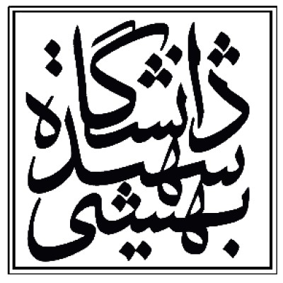

# 								The God We Trust

## 									Mohammad Hossein Basouli

## 												SID: 401222020

# Linear Algebra Project

## Overview
This project uses some of the basic tools in Linear Algebra to manipulate images to get the desired outputs and results

## Technologies Used
- Python
- NumPy

## Implementation

- ### **resize_img**:

  - **Parameters**: image, x_scale (scaling amount along the x-axis) and y_scale (scaling amount along the y-axis)

  - **Approach**: It first creates an empty array of the appropriate size and then tries to find the nearest corresponding pixel on from the original image for each of the pixels in the output image

  - **Result**:

    ​							  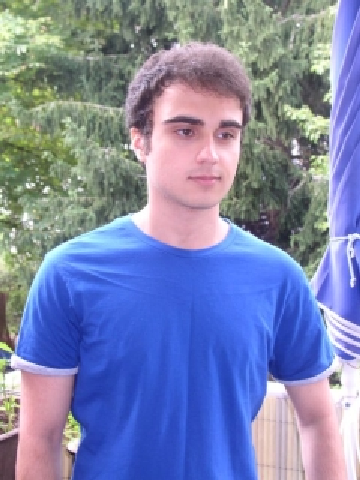

- ### **rotate_img**:

  - **Parameters**: image, θ (amount of counter-clockwise rotation w.r.t origin of the image)

  - **Approach**: It first creates an empty array of the appropriate size and then simply finds the final position for each pixel of the image by multiplying it by the rotation matrix.
    $$
    \begin{bmatrix}
    \cos(\theta) & -\sin(\theta) \\
    \sin(\theta) & \cos(\theta)
    \end{bmatrix}
    \text{ Rotation Matrix}
    $$

  - **Result**: 

 												 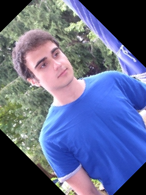

- ### **blur_img**:

  - **Parameters**: image 
  - **Approach**: The method takes the input image and divides it into 10x10 pixel regions. For each region, it applies a blurring method based on the provided `method` parameter. Two blurring methods are implemented: `method == 1` uses `convolve_gaussian_kernel_1`, and `method == 2` uses `convolve_gaussian_kernel_2`.

  #### `convolve_gaussian_kernel_1`:

  - **Parameters**: `mat` (a 10x10 part of the image to get convolved).
  - **Approach**: Calculates the average of the blue, green, and red channels for the input region. Then, for each pixel in the region, it subtracts a distance-dependent value from the average color, creating a blurring effect.

  #### `convolve_gaussian_kernel_2`:

  - **Parameters**: `mat` (a 10x10 part of the image to get convolved).

  - **Approach**: Calculates the average of the blue, green, and red channels for the input region. Then, it replaces each pixel in the region with the average color channel of the entire region, resulting in a uniform color for that region.

    - Result:
      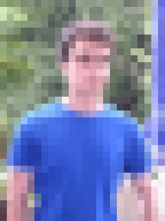 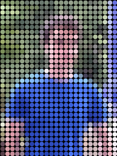

    

- ### sharpen_img

  - **Parameters**: image.

  - **Approach**: Enhances edges and details by convolving a specific sharpening kernel with 3x3 regions of the image.

  ### `convolve_sharpen_matrix`

  - **Parameters**: `mat` (a 3x3 part of the image to get convolved).

  - **Approach**: Convolves the input 3x3 region with a specific sharpening kernel, enhancing the pixel values based on the weights in the kernel.

  $$
  \text{Sharpening Kernel} = \begin{bmatrix}
  0 & -1 & 0 \\
  -1 & 5 & -1 \\
  0 & -1 & 0
  \end{bmatrix}
  \
  $$

  

  - Result:

    ​										  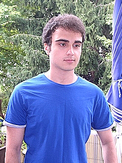

- ### **edge_detect_img**:

  - **Parameters**: image.
  - **Approach**: Detects edges in the image using the Sobel operator. It convolves the image with Sobel kernels for vertical, horizontal, and diagonal edge detection.

  #### `convolve_sobel_kernel`

  - **Parameters**: `mat` (a 3x3 part of the image to get convolved).
  - **Approach**: Convolves the input 3x3 region with Sobel kernels for vertical, horizontal, and diagonal edge detection. Combines the results to calculate the final edge intensity.

  $$
  \text{Sobel Kernel Vertical:}
  \begin{bmatrix}
  1 & 0 & -1 \\
  1 & 0 & -1 \\
  1 & 0 & -1
  \end{bmatrix}
  
  \text{Sobel Kernel Horizontal:}
  \begin{bmatrix}
  1 & 1 & 1 \\
  0 & 0 & 0 \\
  -1 & -1 & -1
  \end{bmatrix}
  
  \text{Sobel Kernel Diagonal 45° Positive:}
  \begin{bmatrix}
  1 & 1 & 0 \\
  1 & 0 & -1 \\
  0 & -1 & -1
  \end{bmatrix}
  
  \text{Sobel Kernel Diagonal 45° Negative:}
  \begin{bmatrix}
  0 & 1 & 1 \\
  -1 & 0 & 1 \\
  -1 & -1 & 0
  \end{bmatrix}

  $$

  

  - Result:

     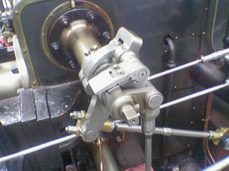 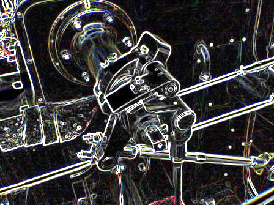

  

- ### **gray_scale_conversion**:

  - **Parameters**: image.

  - **Approach**: Converts the input image to grayscale using the luminosity method.

  - The luminosity method converts a color image to grayscale by taking a weighted average of its RGB channels. The weights (0.2126 for red, 0.7152 for green, and 0.0722 for blue) are chosen to reflect human perception of brightness. The resulting grayscale value represents the perceived luminance of the original pixel. The **gray_scale_conversion** function in the provided code applies this method to produce a grayscale version of a color image

  - Result:

      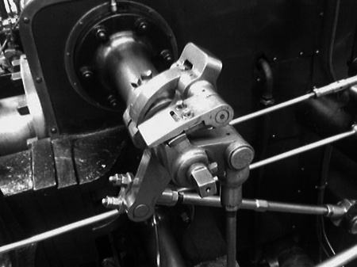

  

- ### **color_inversion**:

  - **Parameters**: image.

  - **Approach**: Inverts the colors of the input image by subtracting each color channel value from 255.

  - For each pixel in the input image:

    - Subtract the blue channel value from 255 to get the inverted blue channel value.
    - Subtract the green channel value from 255 to get the inverted green channel value.
    - Subtract the red channel value from 255 to get the inverted red channel value.
    - Create a new pixel with the inverted blue, green, and red channel values.

  - The resulting image has inverted colors, as each color channel is subtracted from 255, effectively swapping dark and bright tones.

  - Result:

     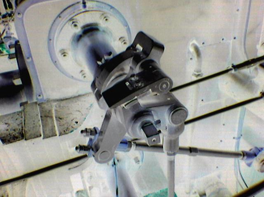

### color_balance

- **Parameters**: image.

- **Approach**: Normalizes the RGB channels of the input image and then combines them. The pixel values are scaled back to the range [0, 255].

- Result: 

  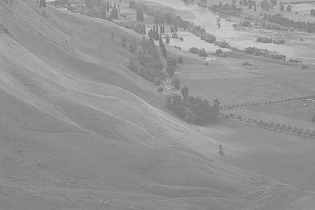 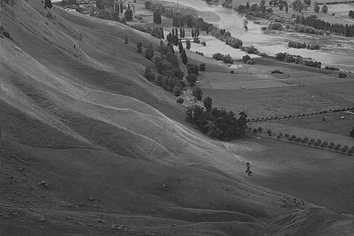
